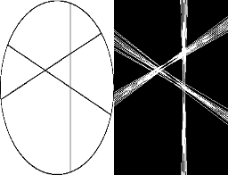
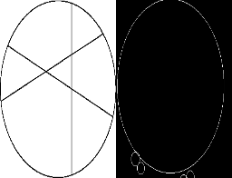

# Line-and-Circle-Detection

Implementation of Hough Transform to detect line and circle in an image.

Demo: https://www.youtube.com/watch?v=AQy5S933Scg&t=32s

# Functions
## gaussian_blur
It returns a gaussian kernel of a given size and variance.
## gradient_calculation
It returns the gradient and edge direction matrices using Sobel filter.
## non_maximum_suppression
It performs non maximum suppression on the gradient image using edge direction matrix.
## double_thresholding
It separates out weak and strong edges.
## edge_tracking
It converts weak edges surrounded by strong ones into strong edges.
## canny
It performs canny edge detection as follows:
1. Convert rgb image to gray.
2. Apply gaussian blur.
3. Calculate gradient along with edge directions.
4. Perform non maximum suppression on the gradient image.
5. Perform double thresholding on the non maximum suppressed image.
6. Perform edge tracking to convert weak edges surrounded by strong ones into strong edges.
## visualize
It just displays an input image.
## line_detection
It performs line detection as follows:
1. Create a 2D array called the accumulator representing the Hough Space with dimension (num_rhos, num_thetas) and initialize all its values to zero.
2. For every pixel on the edge image, check whether the pixel is an edge pixel. If it is an edge pixel, loop through all possible values of θ, calculate the corresponding ρ, find the θ and ρ index in the accumulator, and increment the accumulator base on those index pairs. Loop through all the values in the accumulator. If the value is larger than a certain threshold, get the ρ and θ index, get the value of ρ and θ from the index pair which can then be converted back to the form of y = ax + b.
## circle_detection
It performs circle detection as follows:
1. Using the edges given by the Canny edge detector and for each possible circle, count the number of edges that are part of each circle. However, instead of iterating over all the pixels of all circles, it is faster to iterate over the coordinates of each strong edge and compute the coordinates of the center of all the circles that pass by that point.
2. In order to select which circles are good enough, use two criteria: a threshold (here, at least 40% of the pixels of a circle must be detected) and exclude circles that are too close of each other (here, once a circle has been selected, reject all the circles whose center is inside that circle).

## Line Detection

## Circle Detetction

